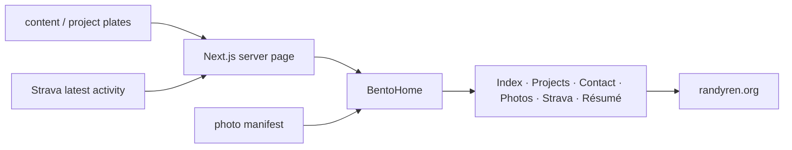

<a name="readme-top"></a>

<p align="center">
  
</p>

<h1 align="center">randyren.org</h1>

<p align="center">
  <em>A working catalogue.</em>
</p>

<p align="center">
  
  
  
  
</p>

<p align="center">
  <a href="https://www.randyren.org">Live</a> ·
  <a href="#catalogue">Catalogue</a> ·
  <a href="#composition">Composition</a> ·
  <a href="#living-data">Living data</a> ·
  <a href="#material">Material</a> ·
  <a href="#run-locally">Run locally</a>
</p>

---

Most portfolios are résumés with a transition library attached.

This one is closer to a desk: work in progress, finished projects, photographs,
contact information, and a little live data sharing the same surface. The page
is deliberately flat and editorial. Projects open into reading plates instead
of routing to a second site. Photographs change between visits. The latest
Strava activity is redrawn as a small line study. Everything else is kept quiet.

The point is not to simulate an application. It is to make the work easy to
look through.

The production app lives in [`site/`](site/). The old root-level `index.html`
is a retired static prototype kept for provenance; it is not the deployed site.

<p align="right"><a href="#readme-top">back to top ↑</a></p>

## Catalogue

The homepage is one asymmetric catalogue rather than a sequence of hero
sections. Each cell has one job:

- **Index.** Name, short biography, and current context.
- **Projects.** A numbered list of selected work. Opening an entry grows the
  row into an editorial plate with project notes, metadata, and navigation.
- **Contact.** The small set of places worth reaching me.
- **Photography.** Two images are selected per visit from the photo manifest.
- **Strava.** The most recent GPS activity becomes a projected SVG polyline.
- **Résumé.** A one-page document preview with direct view and download actions.

The content layer stays separate from the cells themselves. Project order,
copy, captions, and plate data are loaded through `src/content/`; the bento
components render that shape rather than hard-coding a second copy of it.

<p align="right"><a href="#readme-top">back to top ↑</a></p>

## Composition

Desktop uses a three-column, six-row grid. The center column is a photographic
spine; the left and right columns carry the catalogue around it.

```text
┌──────────────────┬──────────────────┬──────────────────┐
│ Index            │                  │ Contact          │
│                  │ Photograph A     │                  │
├──────────────────┤                  ├──────────────────┤
│                  │                  │ Strava           │
│ Projects         ├──────────────────┤                  │
│                  │                  ├──────────────────┤
│                  │ Photograph B     │ Résumé           │
│                  │                  │                  │
└──────────────────┴──────────────────┴──────────────────┘
```

On mobile, **Index stays first** and the remaining six cells are shuffled per
visit, with one constraint: the two photo cells never land back-to-back. The
fixed CSS order remains as the JavaScript-off fallback.

The visual rules are intentionally narrow: hairline borders, a warm off-white
page, almost no radius, no card fills, and motion only where it explains a
state change.

<p align="right"><a href="#readme-top">back to top ↑</a></p>

## Living data

Two parts of the page are allowed to change independently of the written
catalogue.

### Strava

The server fetches the latest GPS activity, decodes its polyline, and projects
it into a `360×200` SVG viewBox before the component renders it. Tokens can live
in a local JSON file during development or in Vercel Edge Config in production.
If Strava is unavailable, the cell falls back to a designed static line rather
than leaving a broken state.

### Photography

The photo system builds from a manifest rather than fixed imports. The server
renders deterministic initial slots so hydration is clean; after mount, the
client picks the visit's layout. Missing image files fail quietly instead of
showing broken-image chrome.

<p align="right"><a href="#readme-top">back to top ↑</a></p>

## Material

The site uses a small material vocabulary and repeats it everywhere.

<table>
  <tr><td><b>Page</b></td><td><code>#fafaf7</code> — warm cream</td></tr>
  <tr><td><b>Ink</b></td><td><code>#0f0f0f</code> — near black</td></tr>
  <tr><td><b>Muted</b></td><td><code>#8a8a8a</code></td></tr>
  <tr><td><b>Rule</b></td><td><code>#d8d8d5</code></td></tr>
  <tr><td><b>Sans / utility</b></td><td>IBM Plex Mono</td></tr>
  <tr><td><b>Editorial serif</b></td><td>Instrument Serif / Newsreader</td></tr>
</table>

The symbol at the top of this README is **Halo**, the same mark shipped as the
site favicon. It is intentionally independent of my initials: two interrupted
rings, one compact silhouette, and enough weight to survive a 16px browser tab
or a Google result without turning into a fuzzy letterform.

<p align="right"><a href="#readme-top">back to top ↑</a></p>

## Under the hood



The application is a Next.js 15 App Router project on React 19 and strict
TypeScript. Biome handles linting/formatting; Playwright is used for browser
smokes. Vercel deploys the `site/` directory from `main`.

The useful scripts are deliberately small:

| Command | What it does |
|---|---|
| `pnpm dev` | Start the local Next.js development server |
| `pnpm build` | Production build |
| `pnpm lint` | `biome check src` |
| `pnpm format` | Format `src/` with Biome |
| `pnpm build:photos` | Rebuild the photo manifest |
| `pnpm db:push` | Push the optional Postgres content schema/data path |
| `pnpm db:seed` | Seed the optional Postgres content path |

<p align="right"><a href="#readme-top">back to top ↑</a></p>

## Run locally

Node 22 and pnpm are the expected toolchain.

```bash
git clone https://github.com/randyren278/new-portfolio.git
cd new-portfolio/site
pnpm install
pnpm dev
```

Then open `http://localhost:3000`.

For a production check:

```bash
pnpm lint
pnpm build
```

Strava is optional. Without credentials, the site still renders its fallback
state. Environment variable examples live in [`site/.env.example`](site/.env.example).

<p align="right"><a href="#readme-top">back to top ↑</a></p>

## Repository map

```text
new-portfolio/
├── README.md                   ← this file
├── index.html                  ← retired static prototype
└── site/                       ← production/deployment root
    ├── src/
    │   ├── app/                ← Next.js App Router + API routes
    │   ├── bento/              ← grid, cells, photo selection, styling
    │   ├── content/            ← catalogue copy + project plate data
    │   └── strava/             ← OAuth, token storage, polyline projection
    ├── public/
    │   ├── favicon.svg         ← Halo
    │   └── photos/             ← portfolio photography
    ├── scripts/                ← manifests, DB helpers, browser smokes
    ├── package.json
    └── CLAUDE.md               ← detailed implementation memory
```

[`site/CLAUDE.md`](site/CLAUDE.md) is the workshop manual: architectural
history, editing constraints, Strava details, content flow, smoke-test notes,
and the things most likely to be broken by an otherwise innocent refactor.

<p align="right"><a href="#readme-top">back to top ↑</a></p>

## What this site is not

- Not a résumé rendered as a webpage.
- Not a component-library showcase.
- Not a terminal-themed developer portfolio anymore.
- Not a reason to add motion where a border change will do.
- Not an attempt to make every piece of personal context "interactive."

The design should get quieter as the work gets stronger.

<p align="right"><a href="#readme-top">back to top ↑</a></p>

## Colophon

Built with Next.js, React, TypeScript, and a small amount of stubbornness about
spacing. Hosted on Vercel. Live at **[randyren.org](https://www.randyren.org)**.

The favicon, README mark, and current site identity use **Halo**.

<p align="right"><a href="#readme-top">back to top ↑</a></p>
